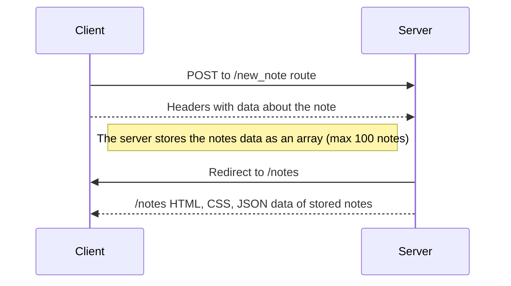

```mermaid
sequenceDiagram

    Client->>Server: POST to /new_note route
    Client-->>Server: Headers with data about the note
    Note left of Server: The server stores the notes data as an array (max 100 notes)
    Server->>Client: Redirect to /notes
    Server-->>Client: /notes HTML, CSS, JSON data of stored notes
```