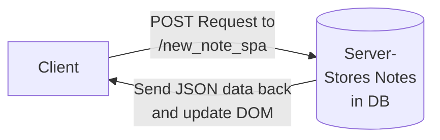

```mermaid
    flowchart LR
        A[Client] --> |POST Request to 
        /new_note_spa| B[(Server-
        Stores Notes 
        in DB)]
        B --> |Send JSON data back
        and update DOM| A
```